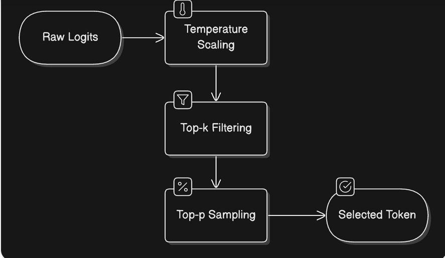
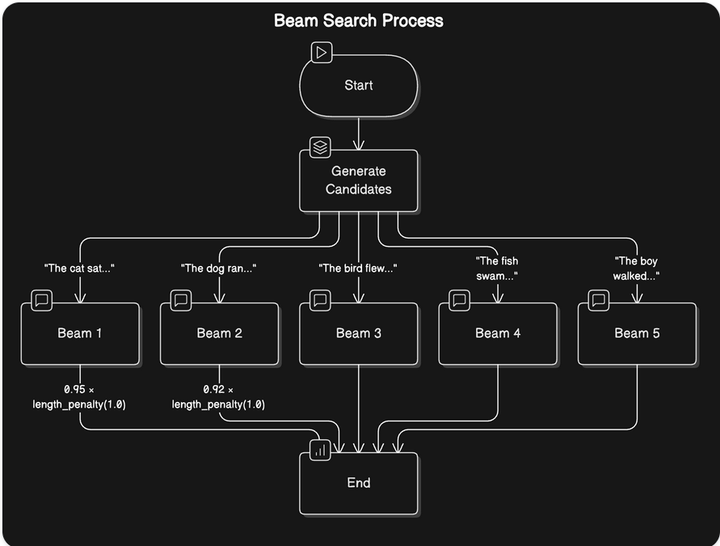
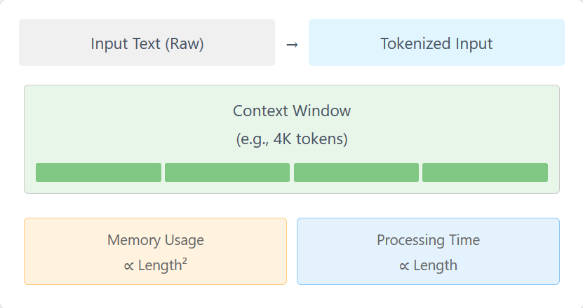

# Inference

- Inference is the process of using a trained LLM to generate human-like text from a given input prompt.
- Language models use their knowledge from training to formulate responses one word at a time. 

- **Inference:** Using a trained LLM to generate human-like text from a given input prompt.

- **Sequential Gneration:** Models predict and generate the next token in a sequence, one word at a time.

- **Learned Probabilities:** LLMs leverage probabilites from billions of parameters to generate coherent and contextually relevant text.

## Role of Attention

- The attention mechanism gives the LLMs the ability to understand context and generate coherent responses. When predicting the next word, not every word in a sentence carries equal weight.

- This ability to focus on relevant information is what we call attention.

- **Attention Mechanisms:** Enables LLMs  to understand context and generate coherent responses.

- **Relevant information:** Focuses on crucial words to predict the next token.

- **Advancements:** Improved scaling and efficiency in handling longer sequences.

## Context length and Attention Span

- The context length/attention span refers to the maximum number of tokens that the LLM can process at once. 

- **Context length:** Maximum number of tokens an LLM can process at once.

- **Limitations:** Constrained by model architecture, computational resoures and input complexity.

- **Balancing Act:** Different models are designed with varying context lengths to balance capability and efficiency.

## Prompting

- **prompting:** structuring input to guide LLM generation toward desired output.

- **Importance of Wording:** The input sequence's wording significantly influences the model's predictions.

## The two phase inference process

- **Prefill phase:** Tokenization, embedding conversion and initial processing

    - Tokenization: Converting the input text into tokens
    - Embedding Conversion: Transforming these tokens into numerical representations that capture their meaning.
    - Initial Processing: Running these embeddings through the model's neural networks to create a rich understanding of the context.

- **Decode phase:** Autoregressive text generation, involving attention computation, probability calculation, token selection and continuation check.

    - Attention computation: Looking back at all previous tokens to understand context
    - Probability Calculation: Determining the likelihood of each possible next token.
    - Token Selection: Choosing the next token based on these probabilities.
    - Continuation Check:Deciding whether to continue or stop generation

## Sampling strategies

### Understanding token selection

- When the model needs to chose the next token, it starts with raw probabilities(called logits) for every word in its vocabulary

1. Raw Logits: Model's predictions about each possible next step.

2. Temperature control: controls whether the output should be random and creative or more focused and deterministic.

3. Top-p(Nucleus) Sampling: Instead of considering all possible words, we only look at the most likely ones that add up to our chosen probability threshold.

4. Top-k filtering: We onlu consider the k most likely next words.

- **Token selection:** From raw logits to token choices, involving temperature control, top-p sampling and top-k filtering.

- One common challenge with LLMs is their tendency to repeat themselves.To address this we have 2 types of penalties:
    1. Presence penalty: A fixed penalty applies to any token that has appeared before, regardless of how often.
    2. Frequency penalty: A scaling penalty that increases based on how often a token has been used.
- These are applied during the token selection process, adjusting the raw probabilities before other sampling strategies are applied.

- **Managing Repetition:** Presence and frequency penalties to keep output fresh.

- **Controlling Generation Length:** Token limits, stop sequences, and end-of-sequence detection.

1. Token limits: setting minimum and maximum token counts

2. Stop sequences: defining specific patterns that signal the end of generation.

3. End-of sequence detection: Letting the model naturally conclude its response.

## Managing Repetition

- **challenge:** LLMs can tend to repeat themselves.

- **Presence penalty:** Fixed penalty for any previously appeared token.

- **Frequency Penalty:** Scaling penalty based on how often a token has been used.

- **Goal:** Encourage exploration of new vocabulary.

## Controlling generation length

- **Importance:** Crucial for practical applications

- **Methods:**
    1. Token Limits: set min/max token counts.
    2. Stop sequences: Define patterns to signal the end.
    3. End-of-sequence detection: Let the model naturally conclude.
- Goal: Ensure output is appropriately sized and focused.

## Beam Search

- Beam search takes a more holistic approach. Instead of commiting to a single choice at each step, it explores multiple possible paths simultaneously.

- **Holistic Approach:** Explores multiple possible paths simultaneously.

- **Process:** Maintain candidate sequences, compute probabilities, keep most promising combinations and select the best sequence.

- **Trade-off**: More computational resources for improved coherence.

### working

1. At each step, maintain multiple candidate sequences.
2. For each candidate, compute probabilities for the next token
3. Keep only the most promising combinations of sequences and next tokens.
4. Continue this process until reaching the desired length or stop condition.
5. Select the sequence with the highest overall probability.

## Practical Challenges and Optimization

- Key metrics: Time tp first token, time per output token, throughput and VRAM usage

- Context length challenge: Balancing memory usage, processing speed and resource allocation.

- KV Cache Optimization: Improves inference speed by storing and reusing intermediate calculations.

### Key performance metrics

1. Time to First Token: How quickly can we get the first token.

2. Time per output token: How fast can we generate subsequent tokens. determines the overall generation speed

3. Throughput: How many requests can be handled simulatneously. affects scaling and cost effciency.

4. VRAM usage: How much GPU memory do we need.

## The context length challenge

1. Memory usage: Grows quadratically with context length

2. Processing speed: decreasrs linearly with longer contexts

3. Resource Allocation: Requires careful balancing of VRAM usage

## The KV Cache Optimization

- Key-value caching. 

- stores and reuses intermediate calculations. This optimization:

1. Reduces repeated calculations

2. Improve generation speed

3. Makes long-context generation practical

- The trade-off is additional memory usage.

