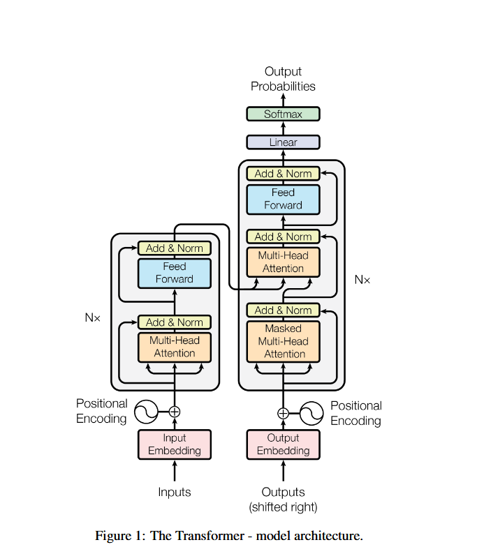
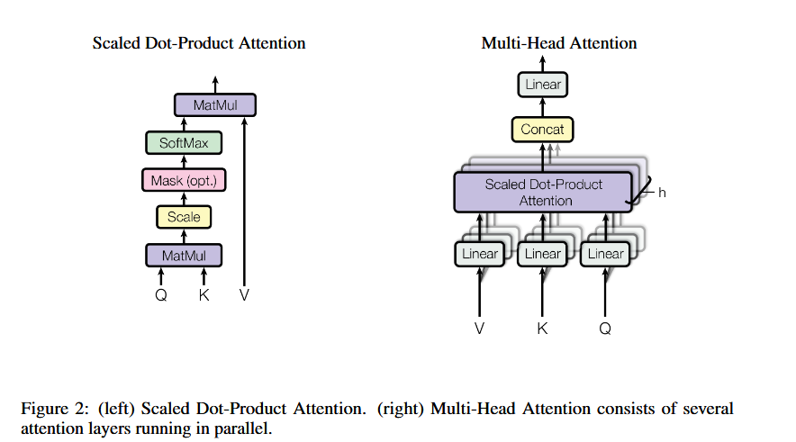
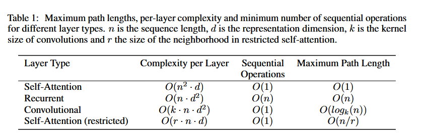
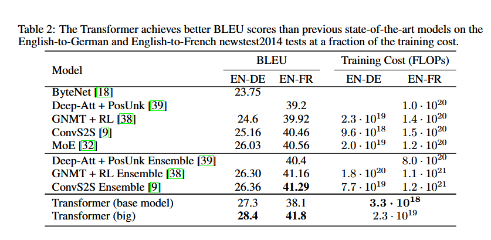

# ATTENTION IS ALL YOU NEED

## Abstract

- The dominant sequence transduction models are based on complex recurrent or convolutional neural networks that include an encoder and a decoder. 

- The best performing models also connect the encoder and decoder through an attention mechanism. 

- This paper introduces the Transformer architecture.

- For stats, this model achieved 28.4 BLEU on the WMT 2-14 English-to-German translation task, improved by over 2 BLEU. On the WMT 2014 English-to-French translation task, this model estabblishes a new single-model state-of-the-art BLEU score of 41.8 after training for 3.5 days on eight GPUs.

## Introduction

- Recurrent models typically factor computation along the symbol positions of the input and output sequences. By aligning the positions to steps in computation time, they generate a sequence of hidden states $h_{\text{t}}$, as a function of the previous hidden state $h_{\text{t-1}}$ and the input of position t. This inherently sequential nature precludes parallelization  within training  examples.

- Attention mechansims have become an integral part of compelling sequence modeling and transduction models in various tasks, allowing modeling of dependencies without regard to their distance in the input or output sequences.

## Background

- Self attention, also known as intra-attention mechanism relating different positions of a single sequence in order to compute a representation of the sequence. Self-attetntion has been used successfully in a variety of tasks including reading comprehension, abstractibe summarization, textual entailment and learning task-independent sentnece representations.

- End-to-end memory networks are based on a recurrent attention mechanism instead of sequence-aligned recurrence and have been shown to perform well on simple-language question answering and language modeling tasks.

## Model Architecture

- Most competitive neural sequence transduction models have an encoder-decoder structure.

- Here, the encoder maps an input sequence of symbol representations $(x_1,\ldots,x_{\text{n}})$ to a sequence of continuous representations $z=(z_1,\ldots,z_{\text{n}})$. Given z, the decoder then generates an output sequence $(y_1,\ldots,y_{\text{m}})$ of symbols one element at a time. At eeach step the model is auto-regressive, consuming the previously generated symbols as additional input when generating the next.

## Encoder and Decoder Stacks

- **Encoder**: The encoder is composed of a stack pf N=6 identical layers. Each layer has 2 sub layers. The first is a multi-head self-attention mechanism and the second is a simple, positionwise fully connected feed-forward network. We employ a residual connection around each of the two sub-layers, followed by layer normalization. That is , the output of each sub-layer is LayerNorm(x+Sublayer(x)), where Sublayer(x) is the function implemented by the sub-layer itself. To facilitate these residual connections, all sublayers in the model, as well as the embedding layers, produce outputs of dimensions $d_{\text{model}}=512$

- **Decoder:** The decoder is also composed of a stack of N=6 identical layers. In addition to the two sub-layers in each encoder layer, the decoder inserts a third sub-layer, which performs multi-head attention over the output of the encoder stack. Similar to the encoder, we employ residual connections around each of the sub-layers, followed by layer normalization.  We also modify the self-attention sub-layer in the decoder stack to prevent positions from attending to subsequent positions. This masking, combined with fact that the output embeddings are offset by one position, ensures that the predictions for position i can depend only on the known outputs at positions less than i.

## Attention

- An attention function can be described as mapping a query and a set of key-value pairs to an output, where the query,key, values and output are all vectors. The output is computed as a weighted sum of the values, where the weight assigned to each value is computed by a compatibility function of the query with the corresponding key.

## Scaled Dot-Product Attention

- The input consists of queries and keys of dimension $d_{\text{k}}$, and values of dimension $d_{\text{v}}$. We compute the dot products of the query with all keys, divide each by $\sqrt{d_{\text{k}}}$, and apply a softmax function to obtain the weights on the values.

- We compute the attention function on a set of queries simultaneously, packed together into a matrix Q. The keys and values are also packed together into matrices K and V. We compute the matrix of outputs as:

$$
    Attention(Q,K,V)=softmax((QK^T)/{\sqrt{d_{\text{k}}}})V
$$

- The two most commonly used attention functions are additive attention and dot-product(multiplicative attention). Dot product attention is identical to our algorithm, except for the scaling factor of $1/{\sqrt{d_{\text{k}}}}$. Additive attention computes the compatibility function using a feed-forward network with a single hidden layer. 

- Dot produt attention is much faster and more space-efficient in practice, since it can be implemented using highly optimized matrix multiplication code.

- While for small values of $d_{\text{k}}$ the two mechanisms perform similarly, additive attention outperforms dot product attention without scaling for larger values of $d_{\text{k}}$. We suspect that for large values of $d_{\text{k}}$, the dot products grow large in magnitude, pushing the softmax function into regions where it has extremely small gradients. To counteract this effect, we scale the dot products by $1/{\sqrt{d_{\text{k}}}}$.

## Multi-Head Attention

- Instead of performing a single attention function with $d_{\text{model}}$- dimensional keys, values and queries, we found it benefical to linearly project the queries, keys and values h times with different, learned linear projections to $d_{\text{k}}$,$d_{\text{k}}$and $d_{\text{v}}$ dimensions respectively. On each of these projected versions of queries, keys and values we then perform the attention function in parallel, yielding $d_{\text{v}}$-dimensional output values. These are concatenated and once again projected, resulting in the final values.

- Multi-head attention allows the model to jointly attend to information from different representation subspaces at different positions. With a single attention head, averaging inhabits this.

$$
\[
\text{MultiHead}(Q,K,V) = \text{Concat}(head_1, \ldots, head_h) W^{O}
\]
\cr
\text{where } head_i = \text{Attention}(Q W_i^{Q},\, K W_i^{K},\, V W_i^{V})
\
\[
\text{with parameter matrices } 
W_i^{Q} \in \mathbb{R}^{d_{\text{model}} \times d_k},\,
W_i^{K} \in \mathbb{R}^{d_{\text{model}} \times d_k},\,
W_i^{V} \in \mathbb{R}^{d_{\text{model}} \times d_v},\,
W^{O} \in \mathbb{R}^{h d_v \times d_{\text{model}}}.
\]
$$

- In this work we employ h = 8 parallel attention layers or heads. For each of these we use dk = dv = dmodel/h = 64. Due to the reduced dimension of each head, the total computational cost is similar to that of single-head attention with full dimensionality.

## Applications of Attention in our Model

- In the encoder-decoder attention layers, the queries come from the previous decoder layer, and the memory keys and values come from the output of the encoder. This allows every position in the decoder to attend over all positions in the input sequence. This mimics the typical encoder-decoder attention mechanisms in sequence-to-sequence models.

- The encoder contains self-attention layers. In a self-attention layer all of the keys, values and queries come from the same place, in this case, the output of the previous layer in the encoder. Each position in the encoder can attend to all positions in the previous layer of the encoder.

- Similarly, self-attention layers in the decoder allow each position in the decoder to attend to all positions in the decoder up to and including that position. We need to prevent leftward information flow in the decoder to preserve the auto-regressive property. We implement this inside of scaled dot-product attention by masking out (setting to $-\infty$) all values in the input of the softmax which correspond to illegal connections.

## Position-wise Feed-Forward Networks

- In addition to attention sub-layers, each of the layers in our encoder and decoder contains a fully connected feed-forward network, which is applied to each position separately and identically. This consists of two linear transformations with a ReLU activation in between.

$$
FFN(x)=max(0,xW_1+b_1)W_2+b_2
$$

- While the linear transformations are same across different positions, they use different parameters from layer to layer. Another way of describing this is as two convolutions with kernel size 1. The dimensionality of input and output is $d_{\text{model}}=512$ and the inner-layer has dimensionality $d_{\text{ff}}=2048$.

## Embeddings and Softmax

- Similarly to other sequence transduction models, we use learned embeddings to convert the input tokens and output tokens to vectors of dimension $d_{\text{model}}$. We also use the usual learned linear transformation and softmax function to convert the decoder output to predicted next-token probabilities. In the model, they share the same weight matrix beween the two embedding layers and the pre-softmax linear transformation. 

- In the embedding layers, we multiply those weights by $\sqrt{d_{\text{model}}}$.

## Positional encodings

- Since our model contains no recurrence and no convolution, in order for the model to make use of the order of the sequence, we must inject some information about the relative or absolute position of the tokens in the sequence. To this end, we add "positional encodings" to the input embeddings at the bottoms of the encoder and decoder stacks. The positional encodings have the same dimension $d_{\text{model}}$ as the embeddings, so that the two can be summed.

- We used sine and cosine funcctions of different frequencies:

$$
[PE_{(pos,2i)} = \sin\!\left(\frac{pos}{10000^{2i/d_{\text{model}}}}\right)]\cr
[PE_{(pos,2i+1)} = \cos\!\left(\frac{pos}{10000^{2i/d_{\text{model}}}}\right)]
$$

where pos is the position and i is the dimension. That is, each dimension of the positional encoding corresponds to a sinusoid. The wavelengths form a geometric progression from $2\pi$ to 10000.$2\pi$. 

- Sine allows the model to explorate to sequence lengths longer than the ones encountered during training.

## Why self-attention

- three desiderata:
    1. total computational complexity per layer
    2. amount of computation that can be parallelized(measured by minimum of sequential operations required)
    3. path length between long-range dependencies in the network. 

- a self attention layer connects all positions with a constant number of sequentially executed operations, where a recurrent layer requires O(n) sequential operations. 

- Self attention layers are faster than recurrent layers when the sequence length n is smaller than the representation dimensionality d, which is most often the case with sentence representations used by state-of-the-art models in machine translations, such as word-piece and byte-pair representations.

- A single convolutional layer with kernel width k< n doesnot connect all pairs of input and output positions. 

- As a side benefit, self-attention could yield more interpretable models. 

