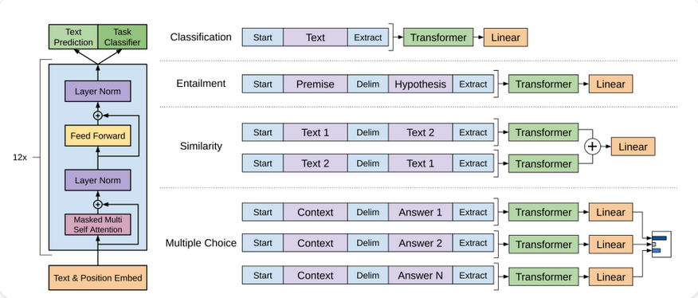
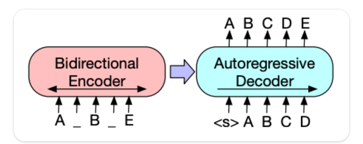
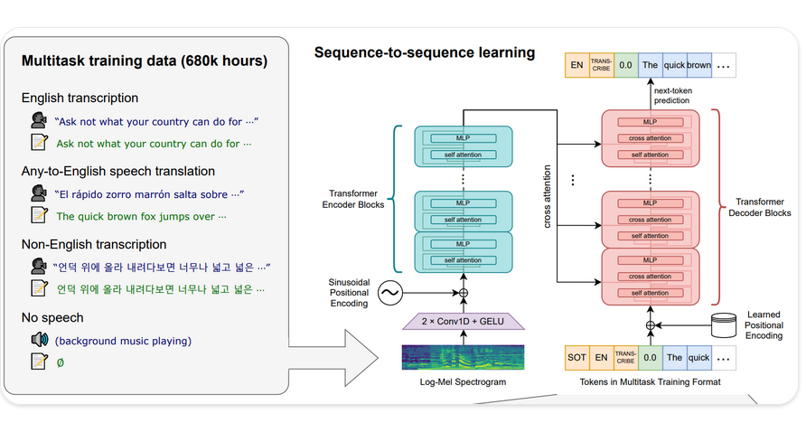

# How transformers solve tasks

- Most tasks follow a similar pattern: input data is processed through a model, and the output is interpreted for a specific task.

## Transformer models for language

- Language models are at the heart of modern NLP. They're designed to understand and generate human language by learning the statistical patterns and relationships between words or tokens in text.

- The transformer was initially designed for machine translation, and since then, it has become the default architecture for solving all AI tasks. Some taks lend themselves to the Transformer's encoder structure, while others are better suited for the decoder. Other tasks use both the encoder-decoder structure.

## How language models work

- Language models work by being trained to predict the probability of a word given the context of surrounding words. This gives them a foundational undersatanding of language that can generalize to other tasks.

- 2 main appproaches for training a transformer model:

1. **Masked Language Modeling**: USed by encoder models like BERT, this approach randomly masks some tokens in the input and trains the model to predict the original tokens based on the surrounding context. This allows the models to learn bidirectional context(looking at words both before and after the masked word).

2. **Casual Language Modeling**: Used by decoder models like GPT, this approach predicts the next token based on all previous tokens in the sequence. The model can only use context from the left(previous tokens) to predict the next token.

## Types of Language models

1. **Encoder-only models(like BERT)**: These models use a bidirectional approach to understand context from both dirctions. They're best suited for tasks that require deep understanding of text, such as classification, named entity recognition and question answering.

2 **Decoder-only models**: These models process text from left to right and are particularly good at text generation tasks. They can complete sentences, write essays, or even generate code based on a prompt.

3. **Encoder-decoder models:** These models combine both approaches, using an encoder to understand the input and a decoder to generate output. They excel at sequence-to-sequence tasks like translation,summarization and question answering.

### Text generation

- GPT-2 is a decoder-only model pretrained on a large amount of text. It can generate convincing text given a prompt and complete other NLP taks like question answering despite not being explicitly trained to.

1. GPT-2 uses _byte pair encoding_ to tokenize words and generate a token embedding. Positional encodings are addded to the token embeddings to indicate the position of each token in the sequence. The input embeddings are passed through multiple decoder blocks to output some final hidden state. Within each decoder block, GPT-2 uses a masked self-attention layer which means GPT-2 can't attend to future tokens. It is only allowed to attend to tokens on the left. This is different from BERT's[mask] token because, in masked self-attention, an attention mask is used to set the score to 0 for future tokens.

- The output from the decoder is passed to a language modeling head, which performs a linear transformation to convert the hidden states into logits. The label is the next token in the sequence, which are created by shifting the logits to the right by one. The cross-entropy loss is calculated between the shifted logits and the labels to output the next most likely token.

### Text classification

- Text classification involves assigning predefined categories to text documents, such as sentiment analysis, topic classification or spam detection.

- BERT is encoder-only model and is the first model to effectively implement deep bidirectionality to learn richer representations of the text by attending to words on both sides.

1. BERT uses WordPiece tokenization to generate a token embedding of the text. To tell the difference between a single sentence and a pair of sentences, a special [SEP] token is added to differentiate them. A special [CLS] token is added to the beginning of every sequence of text. The final output with the [CLS] token is used as the input to the classification head for classification tasks. BERT also adds a segment embedding to denote whether a token belongs to the first or second sentence in a pair of sentences.

2. BERT is pretrained with two objectives: masked language modeling and next-sentence prediction. In masked language modeling, some percentage of the input tokens are randomly masked,and the model needs to predict these. This solves the issue of bidirectionality, where the model could cheat and see all the words and "predict" the next word. The final hidden states of the predicted mask tokens are passed to a feedforward network with a softmax over the vocabulary to predict the masked word.

- The second pretraining object is next-sentence prediction. The model must predict whether sentence B follows sentence A. Half of the time sentence B is the next sentence, and the other half of the time, sentence B is a random sentence. The prediction, whether it is the next sentence or not, is passed to a feedforward network with a softmax over the two classes(IsNext and NotNext)

3. The input embeddings are passed through multiple encoder layers to output some final hidden states.

- To use the pretrained model for text classification, add a sequence classification head on top of the base BERT model. The sequence classification head is a linear layer that accepts the final hidden states and performs a linear transformation to convert them into logits. The cross-entropy loss is calculated between the logits and target to find the most likely label.

### Token Classification

- Token classification involoves assigning a label to each token in a sequence, such as in named entity recoognition or part-of-speech tagging.

- To use BERT for token classification tasks like named entity recognition (NER), add a token classification head on top of the base BERT model. The token classification head is a linear layer that accepts the final hidden states and performs a linear transformation to convert them into logits. The cross-entropy loss is calculated between the logits and each token to find the most likely label.

### Question Answering

- To use BERT for question answering, add a span classification head on top of the base BERT model. This linear layer accepts the final hidden states and performs a linear transformation to compute the span start and end logits corresponding to the answer. The cross-entropy loss is calculated between the logits and the label position to find the most likely span of text corresponding to the answer.

### Summarization

- Involves condensing a longer text into a shorter version while preserving its key information and meaning.

- Encoder-decoder models such as BART and T5 are designed for the sequence-to-sequence pattern of a summarization task.

1. BART's encoder architecture is very similar to BERT and accepts a token and positional embedding of the text. BART is pretrained by corrupting the input and then reconstructing it with the decoder. Unlike other encoders with specific corruption strategies, BART can apply any type of corruption.

- The _text infilling_ corruption strategy works the best. A number of text spans are replaced with a single[mask] token. This is important because the model has to predict the masked tokens, and it teaches the model to predict the number of missing tokens. The input embeddings and masked spans are passed through the encoder to output some final hidden states, but unlike BERT, BART doesn't add a final feedforward network at the end to predict a word.

2. The encoder's output is passed to the decoder, which must predict the masked tokens and any uncorrupted tokens from the encoder's output. This gives additional context to help the decoder restore the original text. The output from the decoder is passed to a language modeling head, which performs a linear transformation to convert the hidden states into logits.The cross-entropy loss is calculated between the logits and the label, which is just the token shifted to the right

### Translation

- Translation involves converting text from one language to another while preserving its meaning. Translation is another example of a sequence-to-sequence task. 

- BART adapts to translation by adding a separate randomly initalized encoder to map a source language to an input that can be decoded into the target language. This new encoder's embeddings are passed to the pretrained encoder instead of the original word embeddings. The source encoder is trained by updating the source encoder, positional embeddings and input embeddings with the cross-entropy loss from the model output. The model parameters are frozen in this first step and all the model parameters are trained together in the second step. BART has since been followed up by a multilingual version,mBART, intended for translation and pretrained on many different languages.

### Speech and audio

- Whisper is an encoder-decoder transformer pretrained on 680,000 hours of labeled audio data. 

- The decoder allows whisper to map the encoders learned speech representations to useful outputs, such as text, without additional fine-tuning.

- 2 main components:
    1. An encoder processes the input audio. The raw audio is first converted into a log-Mel spectrogram.This spectrogram is then passed through a Transformer encoder network.
    
    2. A decoder takes the encoded audio representation and autoregressively predicts the correspoonding text tokens. It's a standard Transformer decoder trained to predict the next text token given the previous tokens and the encoder output. Special tokens are used at the beginning of the decoder input to steer the model towards the specific tasks like transcription, translation or language identification.

### Computer Vision

- 2 ways to approach computer vision tasks:

1. Split an image into a sequence of patches and process them in parallel with a Transformer.

2. Use a modern CNN, like ConvNeXT, which relies on convolutional layers but adopts modern network designs.

### Image classification

- ViT and ConvNeXT can both be used. The only difference is that the first uses attention and the second uses convolutions.

- The main change ViT introduced was in how to feed the images to the Transformer.

1. An image is split into square non-overlapping patches, each of which gets turned into a vector or _patch embedding_. the patch embeddings are generated from a convolutional 2D layer which creates the proper input dimensions.

2. A _learnable encoding_- a special [CLS] token is added to the beginning of the patch embeddings just like BERT. The final hidden state of the [CLS] token is used as the input to the attached classification head; other outputs are ignored.

3. The last thing to add to the patch and learnable embeddings are the _position embeddings_ because the model doesn't know how the image patches are ordered. They have the same size as the patch embeddings. All embeddings are then fed to the Transformer's encoder.

4. The output, specifically only the output with the [CLS] token, is passed to a multilayer perceptron head. The MLP head converts the output into logits over the class labe;s and calculates the cross-entropy to find the most likely class.

