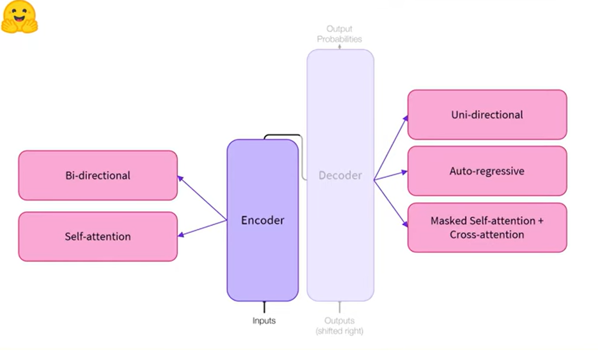
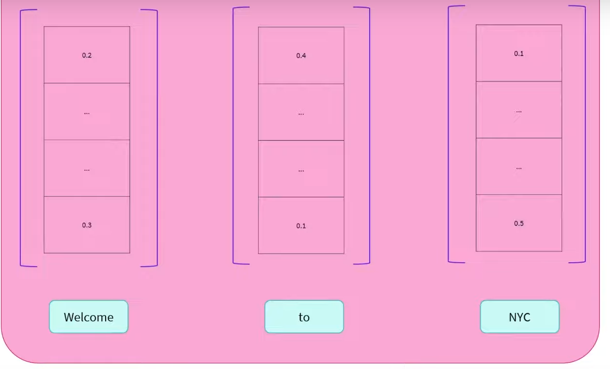
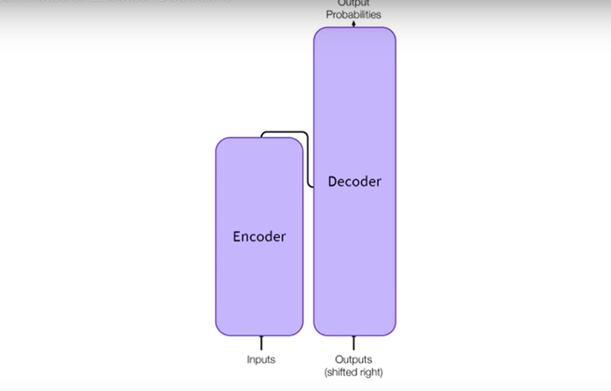
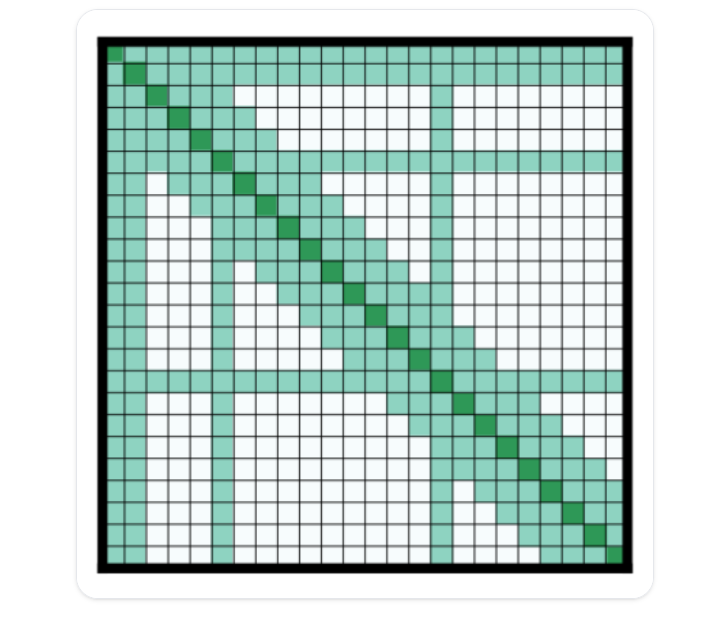

# Transformers Architecture

## Encoder structure

- 

- The encoder outputs a numerical representation for each word used as input.

- 

- Bi-directional: context from left and right

- Good at extracting meaningful information

- Natural Language Understanding

- At each stage, the attention layer can access all the words in the initial sentence. These models are often characterized as having "bi-directional" attention and are called *auto-encoding* models.

- The pretraining of these models usually revolves around somehow corrupting a given sentence(eg. by masking random words in it) and tasking the model with finding or reconstructing the inital sentence.

- Encoder models are best suited for tasks requiring an understanding of the full sentence, such as sentence classification, named entity recognition and extractive question answering.

## Decoder Models

- uni-directional
- auto-regressive
- masked self-attention+ cross attention

- outputs numerical representation from an initial sequence.

- words can only see the words on their left side.

- Natural Language Generation

- The pretraining of the decoder models usually revolves around predicting the next word in the sentence.

## Modern Large Language Models(LLMs)

- Most modern Large Language Models use the decoder-only architecture. 

- They are typically trained in 2 phases:

1. **Pretraining**: The model learns to predict the next token on vast amounts of text data.

2. **Instruction tuning**: The model is fine-tuned to follow instructions and generate helpful responses.

## Sequence-to-sequence models

- 

- encoder generates numerical representation for the input sequence. This representation is used as an input for the decoder additionaly with a input sequence. 

- The decoder then decodes the representation and generates a word.

- then uses the combination of representation and the first generated word to generate the second word and so on.

- Encoder-decoder models use both parts of the transformer architecture. At each stage, the attention layers of the encoders can access all the words in the initial sentence, whereas the attention layers of the decoder can only access the words positioned before a given word in the input.

- The pretraining of the models can take different forms, but it often involves reconstructing a sentence for which the input has been somehow corrupted.  The pretraining of the T5 model consists of replacing random spans of text with a single mask special token and the task is then to predict the text that this mask token replaces.

- Sequence-to-sequence models are best suited for tasks revolving around generating new sentences depending on a given input, such as summarization, translation, or generative question answering.

## Attention Mechanisms

- Most transformer models use full attention in the sense that the attention matrix is square. It can be a big bottleneck when we have long texts. 

- Longformer and reformer are models that try to be more efficient and use a sparse version of the attention matrix to speed up training.

## LSH attention

- Reformer uses LSH attention. In the $softmax(QK^{\text{t}})$ only the biggest elements (in the softmax dimension) of the matrix QK^t are going to give useful contributions. So for each q in Q, we can consider only the keys k in K that are close to q.

- A hash function is used to determine if q and k are close. The attention mask is modified to mask the current token(except at the first token), because it will give a query and a key equal. 

- Since the hash can be a bit random, several hash functions are used (determined by a n_rounds parameter) and then are averaged together.

## Local attention

- Longformer uses local attention: often, the local context(eg what are the two tokens to the left and right?) is enough to take action for a given token. Also, by stacking attention layers that have a small window, the last layer will have a receptive field of more than just the tokens in the window, allowing them to build a representation of the whole sentence.

- Some preselected input tokens are also given global attention: for those few tokens, the attention matrix can access all tokens and this process is symmetric: all other tokens have access to those specific tokens(on top of the ones in their local window). 

## Axial Positional Encodings

- Reformer uses axial positional encodings: In traditional transformer models, the positional encoding E is a matrix of size lxd, l being the sequence length and d the dimension of the hidden state.

- For long texts, this matrix can be huge and take way too much sapce on the GPU.

- To alleviate that, axial positional encodings consist of factorizing that big matrix E in two smaller matrices E1 and E2,with dimensions $l_1 x d_1$ and $l_2 x d_2$, such that $l_1 x l_2 = l$  and $d_1 + d_2 = d$. The embedding for time step j in E is obtained by concatenating the embeddings for timestep $j % l_1$ in $E_1$ and $j//l_1$ in $E_2$.
